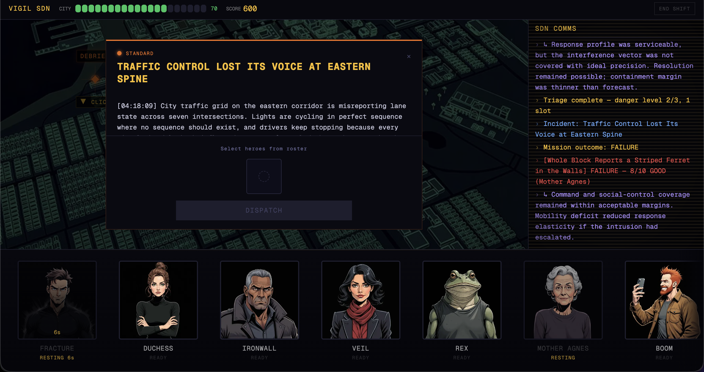
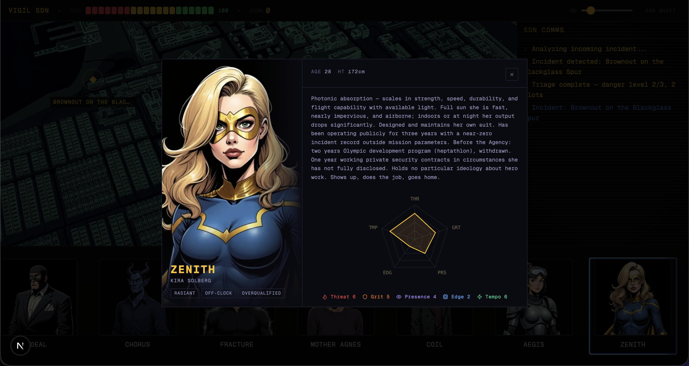
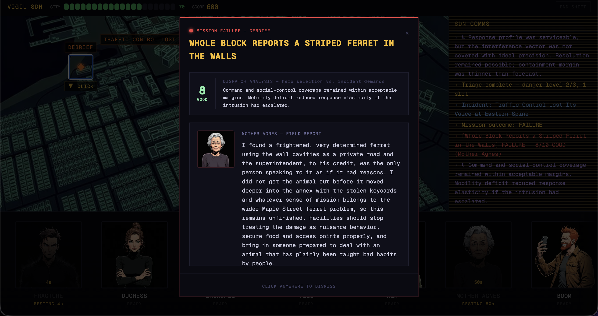
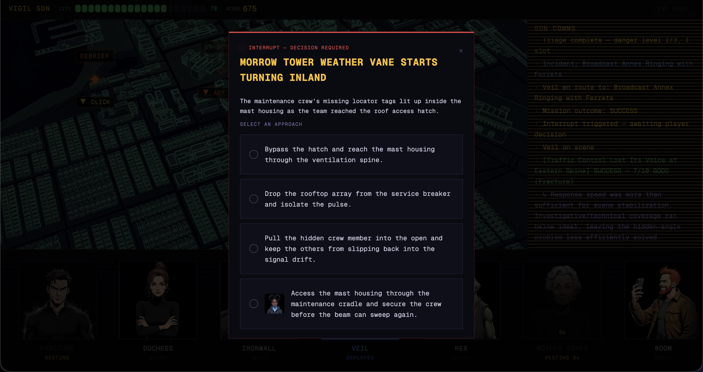
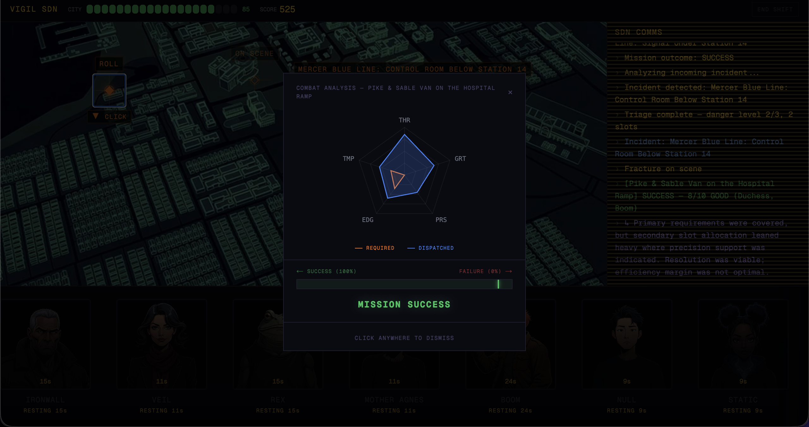

# Vigil

Superhero dispatcher game with a hidden multi-agent AI system that evaluates your decisions in real time.

You assign heroes to incidents on a city map. While you're doing that, a separate agent pipeline is building its own recommendation silently. After the mission — hero field reports written in character, an eval score, and a verdict on whether your dispatch actually made sense given what the incident needed.

## Agents

Seven agents, each with a single job:

- **Incident Generator** — writes briefings with narrative continuity across the session, advancing story arcs between incidents
- **Triage** — extracts required stats, danger level, field intel hints
- **Narrative Pick** — picks the hero that fits the story, unlocks a hero-specific interrupt option
- **Dispatcher** — builds a hidden stat-based recommendation before you commit
- **Hero Report** — writes a first-person field report per hero, in their voice, aware of teammates and what happened
- **Reflection** — rejects reports that are off-voice or don't match the outcome, triggers a rewrite
- **Eval** — compares your dispatch to the hidden recommendation, scores 0–10, writes the post-op note

## Stack

Node.js · TypeScript · Express · PostgreSQL · Drizzle · Next.js · Zustand · OpenAI Agents SDK · MCP · GCP Cloud Run

